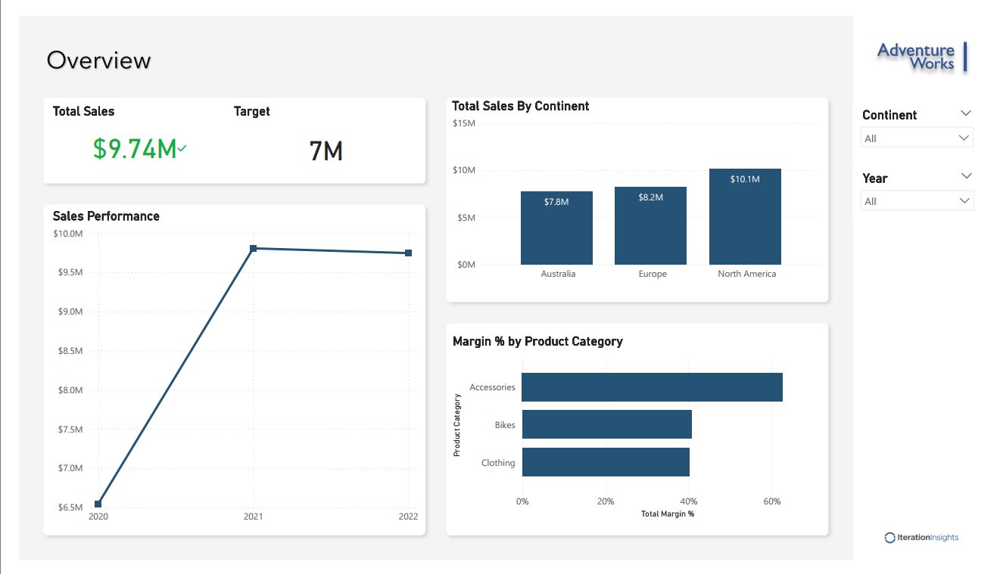

# 📊 Power BI Sales Analysis Project

## 🧩 Overview
This project analyzes multi-year sales data (2020–2022) using **Microsoft Power BI** to track performance, identify trends, and uncover insights that support data-driven business decisions. **Here, I utilized Time Intelligence functions by constructing a Date table.**

---

## 🗂️ Data Model (Star Schema)
Used **star-schema** data model to optimize performance and support accurate time-based calculations.

---

## 📈 Key Insights
- **Sales Growth:** Increased from `$6.5M` in 2020 to `$9.7M` in 2022 — steady year-over-year growth.  
- **Regional Leaders:**  
  - North America — `$10.1M`  
  - Europe — `$8.2M`  
  - Australia — `$7.8M`  
- **Profitability:** Maintained an average **41% total margin** across all product lines.  
- **Product Insights:**  
  - *Accessories* delivered the highest margin %.  
- **Customer Trends:** Over **50% of orders** included 50+ line items — indicating strong repeat or bulk buyers.  
- **Strategic Takeaway:** Focus on high-margin products and target high-performing regions for marketing campaigns.

---

## 🖼️ Dashboard Preview

